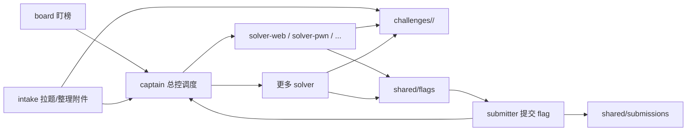

# mini-Scr1wAgent

一个面向 CTF 比赛场景的最小多 Agent 编排器，核心目标是：

- 开赛后快速起盘；
- 把“盯榜 / 拉题 / 分题 / 解题 / 提交”拆给不同 agent；
- 通过共享目录协作，降低重复劳动。

当前主逻辑在 `main.py` 中。

## 开赛会启动几个 agent？

整场比赛模式由 `main.py` 里的预设决定：`main.py:13`。

| preset | solver 列表 | 总 agent 数 |
| --- | --- | --- |
| `lean` | `web`, `pwn` | 6 |
| `balanced` | `web`, `pwn`, `rev`, `crypto` | 8 |
| `aggressive` | `web`, `pwn`, `rev`, `crypto`, `misc`, `forensics` | 10 |
| `finals` | `web`, `pwn`, `rev`, `crypto`, `misc`, `forensics`, `general-1`, `general-2` | 12 |

固定会启动 4 个核心 agent：

1. `captain`：总控调度
2. `board`：盯榜和态势分析
3. `intake`：看题、拉题面、整理附件
4. `submitter`：校验并提交 flag

再叠加 preset 对应数量的 solver。具体构造逻辑见 `match_specs()`：`main.py:274`。

如果是单题模式，则由 `launch-challenge` 按 `--copies` 启动多个专项 solver，逻辑在 `challenge_specs()`：`main.py:295`。

## 流程图



## 每个 agent 是独立目录吗？

是的，**每个 agent 都有自己的独立工作目录**。

整场比赛模式下目录在 `match_specs()` 里定义：`main.py:274`。

- `captain` -> `core/captain`
- `board` -> `core/board`
- `intake` -> `core/intake`
- `submitter` -> `core/submitter`
- 每个 solver -> `core/solver-<affinity>`

单题模式下，每个专项 solver 目录是：

- `challenges/<challenge-slug>/solver-<category>-<index>`

对应逻辑见 `challenge_specs()`：`main.py:295`。

此外还会准备共享协作区，逻辑见 `shared_paths()`：`main.py:60`：

- `shared/board`：榜单与目标
- `shared/intake`：题目索引与题面整理
- `shared/coord`：调度与优先级
- `shared/claims`：认领记录
- `shared/flags`：flag 候选
- `shared/submissions`：提交记录
- `challenges`：每道题自己的资料区

## 这些 agent 知道自己去搜索或者安装 ctfskill 吗？

现在已经在所有 agent 的公共提示块里补上了这条规则，见 `common_block()`：`main.py:75`。

规则是：

- 如果缺少 CTF 常用工具链，先主动搜索有没有现成工具/脚本；
- 必要时可以自行安装，例如 `ctfskill`；
- 但优先选择轻量、可快速验证的方案；
- 安装和使用方法要写回对应目录笔记，方便别的 agent 接手。

也就是说，agent 的预期行为不是“傻等工具就绪”，而是：

1. 先看现成命令/系统工具能不能解；
2. 不够再主动搜索现成 CTF 工具链；
3. 必要时自行安装；
4. 把安装痕迹和结论沉淀到工作目录/共享目录。

## 目录结构示意

```text
.ctfagent-runtime/
├── shared/
│   ├── board/
│   ├── claims/
│   ├── coord/
│   ├── flags/
│   ├── intake/
│   └── submissions/
├── core/
│   ├── board/
│   ├── captain/
│   ├── intake/
│   ├── submitter/
│   ├── solver-web/
│   ├── solver-pwn/
│   └── ...
└── challenges/
    └── <challenge-slug>/
        ├── notes.md
        ├── flag.txt
        └── solver-web-1/
```

## 常用命令

查看当前 preset 会起哪些 agent：

```bash
python main.py roster --preset balanced
```

打印整场比赛模式的启动命令：

```bash
python main.py launch-match --preset balanced --executor print
```

围绕单题开 3 个 web solver：

```bash
python main.py launch-challenge --challenge-name "baby sql" --category web --copies 3 --executor print
```

## 关键实现位置

- 预设 agent 数量：`main.py:13`
- 共享目录布局：`main.py:60`
- 通用 agent 规则（含 ctfskill 安装策略）：`main.py:75`
- 整场比赛 agent 编排：`main.py:274`
- 单题多 solver 编排：`main.py:295`
- 实际启动 subprocess/terminal：`main.py:376`, `main.py:388`
